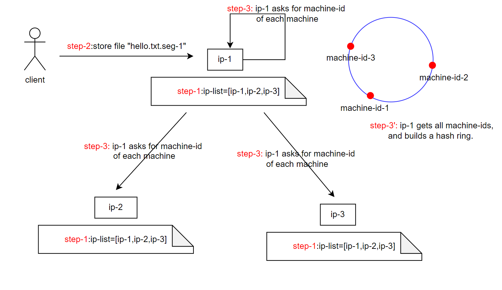

# Flask-LightDFS

Flask-LightDFS is an extension, distributed storage system, for [Flask](https://palletsprojects.com/p/flask/). It aims to realize the distributed storage of files locally, and it is very simple and easy to use.

# Quick Start

# Design and Implementation

## File Identification

Since system may not support authentication, different clients don't know what files others have already uploaded, thus may cause duplicate file name, and the dfs will be confused to fetch the right file.

So LocalDFS allocate a unique key (id) for each file as it is uploaded. Client must store the file-id to access the file.

## Machine Identification

Suppose that there are multiple machines have been deployed (cluster), then we should identify each machine when allocating file partition and searching for file partition.

The simplest way is to use IP ADDRESS, but machine's ip address may be not static. For example, supposed machine A holds ip A at startup, but after rebooting, its ip address changes to ip B. Since other machines don't know that ip B is machine A, it will cause big chaos.

So LocalDFS requires a more stable identifier, which must be preserved persistently. LocalDFS allocate a unique key (id) for each machine in the cluster, and each machine storages the machine-id in it's disk, so the id won't be changed or dicarded in most failure.

In addition, each machine will keep an *\[IP\]-\[Machine-ID\]* map, a *\[Machine-ID\]-\[IP\]* map and other useful data structure in memory, this map records mapping relationship of every machine.

In order to avoid the problem caused by the changes of ip, LocalDFS will check the machine-id while sending data to an ip, if the machine-id doesn't match the *\[IP\]-\[Machine-ID\]* map, it will update the information in map, and then choose a new machine-id to send data.

## Hashing

How to select a machine to allocate file, and manage the allocation information is an important part in almost every distributed storage system. In LocalDFS, we use hashing on file-id to generate a hash-value, and then use consistent-hashing algorithm to select the proper machine to store the file.

The key in LocalDFS's consistent-hashing algorithm is to build the *Hash Ring*, which requires the current machine must have the all machine-ids of in cluster. At startup, none of machine has a machine-id, and the *\[IP\]-\[Machine-ID\]* map is empty. First, the current machine polls each machine in cluster to ask for it's machine-id, if a machine replys that it doesn't have a machine-id, then the current machine will generate an id for it. Secondly, the current machine recieved all the machine-ids and build a complete *\[IP\]-\[Machine-ID\]* map. Finally, the current machine sorts all machine-ids, then a hash ring is builded.

And the whole work-flow of "storing a file" is like:

1. User provide a list of IPs (*IP List*) in code, then several machines run the code. That means all machines/nodes is equivalent and knows how to access others.
2. A client sends a request about storing a file segment, a server (eg. ip-1) recieves this request, then uses a hash function to generate a file-id for this file, and then return the file-id to the client. The client need to remember the file-id to access the file in the future.
3. The server need to decide which machine to storage the file. It use another hash function on file-id to generate a hash-value, then build and check the *Hash Ring* to find a proper machine.

## Fault Tolerant

LocalDFS temporarily does not support strong fault tolerant, that means LocalDFS won't make replica for each file partition.

However, users can implement fault tolerant strategy, such as calling the storage/query API for saveral times using different hash functions.
